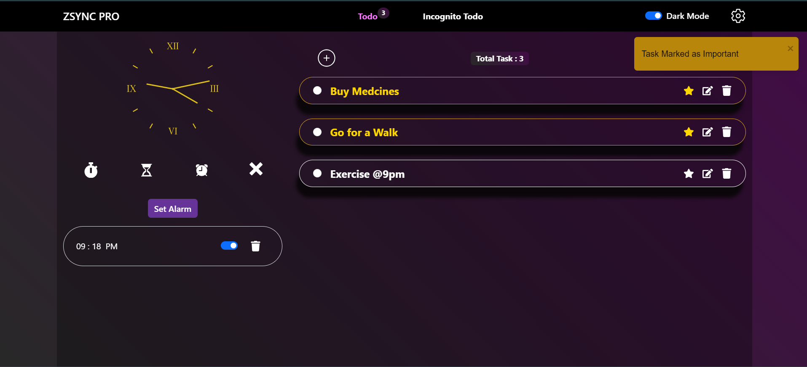
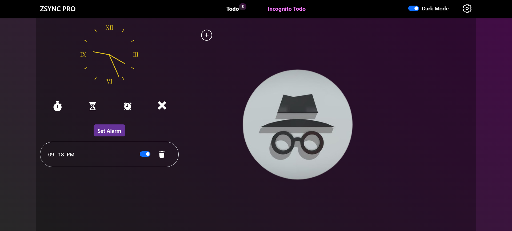
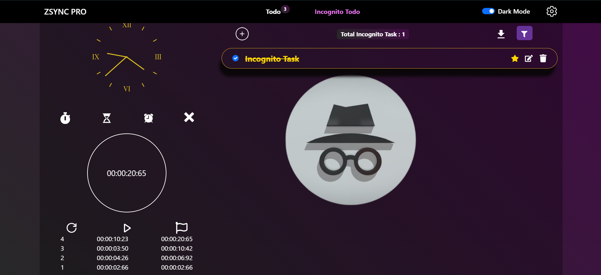

# ZsyncPro

Welcome to ZsyncPro! This React-based project is designed to streamline your task management and enhance productivity.

Check out the live website: [ZSYNC PRO](https://aakashgaur03.github.io/ZSYNC_PRO/)

## Images







## The Journey to ZsyncPro 🌟

Developed over 2 months, ZsyncPro combines innovative features and a user-friendly interface to simplify your workflow.

## Features

### Dark Mode and Light Mode Options 🌓

Switch between dark and light themes to suit your preference.

### Why Choose ZsyncPro? 😫

- **Innovative Task Management 💡**: Handle Normal and Incognito Tasks efficiently.
- **Privacy-First Incognito Tasks 🔒**: Keep sensitive information secure.
- **Integrated Clock Features ⏰**: Manage time with precision.
- **Multiple Clock Sounds 🕰️**: Customize your productivity sessions.
- **Effortless Task Handling 📝**: Easily add, edit, complete, or prioritize tasks.
- **Smart Filtering Options 🔍**: Find tasks quickly.
- **Download Your Tasks 📥**: Access tasks offline.
- **Recently Deleted Section 🗑️**: Restore or permanently delete tasks.
- **Customizable Sound Settings 🎶**: Personalize timer sounds.

## Tech Stack 💻

- **React Bootstrap**: Responsive design
- **React Router Dom**: Routing and navigation
- **React PDF**: PDF generation and display
- **React Toastify**: Non-intrusive notifications
- **React Icons**: Customizable icons

## How to Get Started

1. Clone the repository:

   ```bash
   git clone https://github.com/AakashGaur03/ZSYNC_PRO
   ```

2. Navigate to the project directory:

   ```bash
   cd ZSYNC_PRO
   ```

3. Install dependencies:

   ```bash
   npm install
   ```

4. Start the development server:
   ```bash
   npm run dev
   ```
